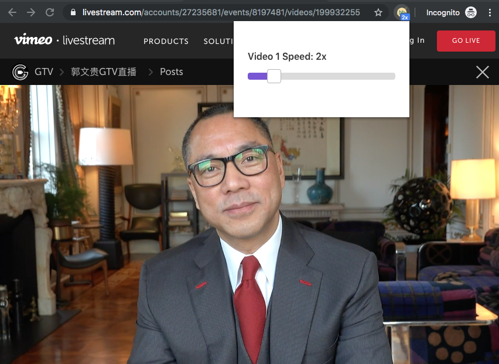
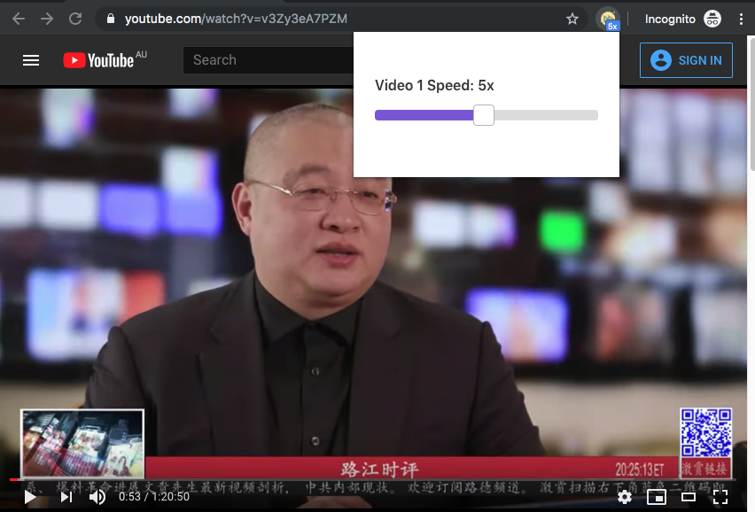
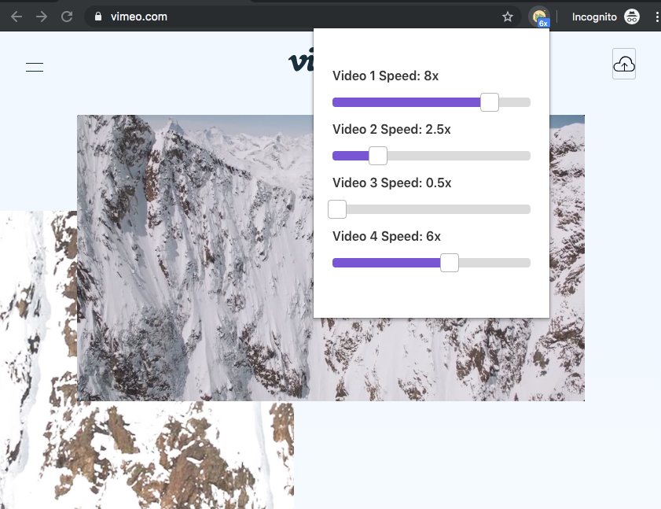

# Video Play Speed Extension

[👉 中文说明 👈](./README-zh_CN.md)

> Powered by [adambullmer/vue-cli-plugin-browser-extension](https://github.com/adambullmer/vue-cli-plugin-browser-extension).

## Intention

Now we can only watch live videos of Miles Kwok (Guo Wengui) 😎 on Livestream which interestingly does not provide YouTube-like playback speed adjustment 🙄. For me, a [996](https://github.com/996icu/996.ICU/blob/master/README.md) programmer, 2x playback speed is a must as I don't have much time 😔.

## Features

* Up to 10x playback speed (useful to skim the ADs 😉).
* Support all the websites including Livestream and YouTube.
* Support adjustments of all the videos on the same page (seems useless).

## Showcase







## For developers

### Pull the code

```
$ git clone https://github.com/Pangu2020together/video-play-speed-extension.git
```

### Install dependencies

```
$ cd video-play-speed-extension
$ npm install
```

### Useful commands

```
$ npm run serve # development
$ npm run build # production
$ npm run lint  # Lint + autofix
```

## TODOs

* Tests
* Introduce TypeScript or Flow

## Security tips

* Softwares (installation packages, extensions / plugins, etc) distributed by other Guo supporters, may not be safe
* Even if it's open-source, the published content could be different (e.g. with malicious code)
* Open source doesn't mean "safe and reliable" unless you can review each line of code and compile it yourself
* As a developer, you'd better develop & debug the "works" from other Guo supporters in VPN + VM environment

The above seems "self-denial" but I want nothing more than to arouse your security awareness. If you are not comfortable with this extension, you can find alternatives by searching "[video speed extension](https://www.google.com/search?q=video%20speed%20extension)".

## ✊✊✊ Everything is just beginning 🙏🏻🙏🏻🙏🏻
